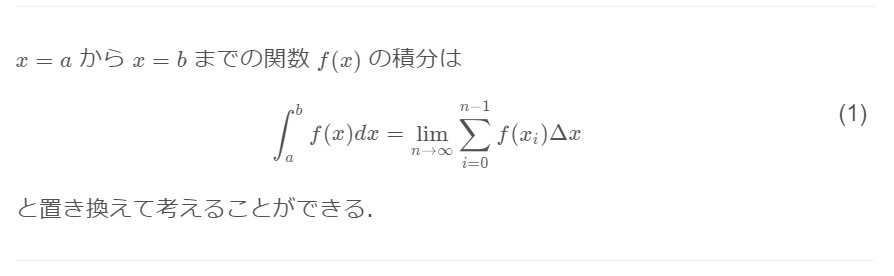

### サブ記事 in _assets

インクルードされた記事が画像を使用していた場合どうなるかを試してみる。

ドキュメントを見ると、`\fig`コマンドのパス指定の基準は _site フォルダがルートのようだ。
```
\fig{/assets/2021-02-10_181534.jpg}
```
\fig{/assets/2021-02-10_181534.jpg}
でOK。

markdown ファイルからの相対パス指定だとエラーが出る。
```
\fig{./2021-02-10_181534.jpg}
```
\fig{./2021-02-10_181534.jpg}


markdown 書式による画像挿入を使うとどうだろうか?
```

```

だとダメで、

```

```

ならOK。

`\fig`コマンドと同じようだ。


